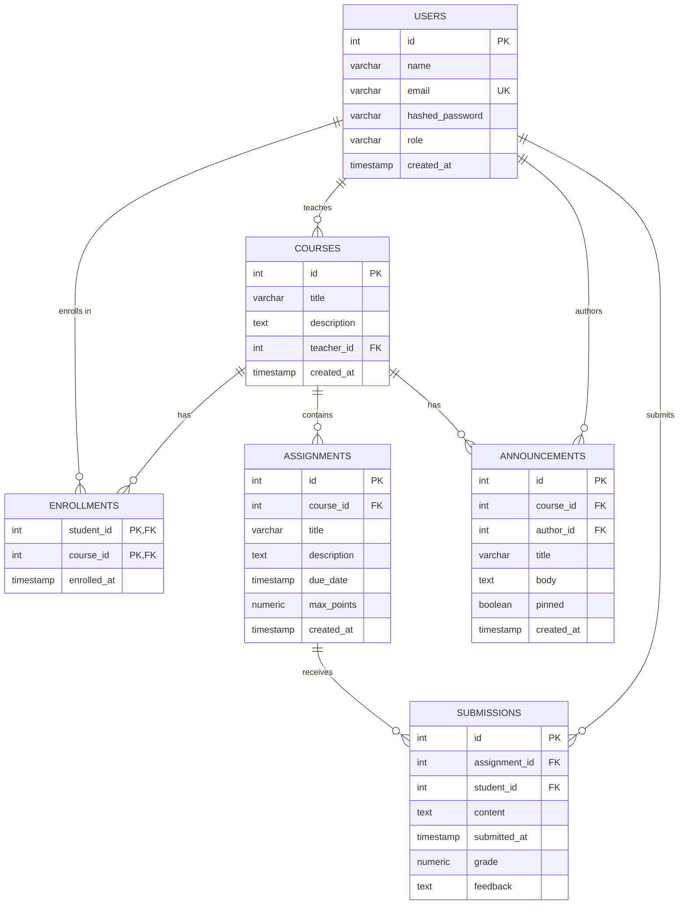

# DukeAcademy 2.0 — ER Diagram

```mermaid
erDiagram
    USERS {
        int id PK
        varchar name
        varchar email UK
        varchar hashed_password
        varchar role
        timestamp created_at
    }
    COURSES {
        int id PK
        varchar title
        text description
        int teacher_id FK
        timestamp created_at
    }
    ENROLLMENTS {
        int student_id PK,FK
        int course_id PK,FK
        timestamp enrolled_at
    }
    ASSIGNMENTS {
        int id PK
        int course_id FK
        varchar title
        text description
        timestamp due_date
        numeric max_points
        timestamp created_at
    }
    SUBMISSIONS {
        int id PK
        int assignment_id FK
        int student_id FK
        text content
        timestamp submitted_at
        numeric grade
        text feedback
    }
    ANNOUNCEMENTS {
        int id PK
        int course_id FK
        int author_id FK
        varchar title
        text body
        boolean pinned
        timestamp created_at
    }

    USERS ||--o{ COURSES       : "teaches"
    USERS ||--o{ ENROLLMENTS   : "enrolls in"
    COURSES ||--o{ ENROLLMENTS  : "has"
    COURSES ||--o{ ASSIGNMENTS  : "contains"
    COURSES ||--o{ ANNOUNCEMENTS : "has"
    ASSIGNMENTS ||--o{ SUBMISSIONS : "receives"
    USERS ||--o{ SUBMISSIONS   : "submits"
    USERS ||--o{ ANNOUNCEMENTS : "authors"
```
